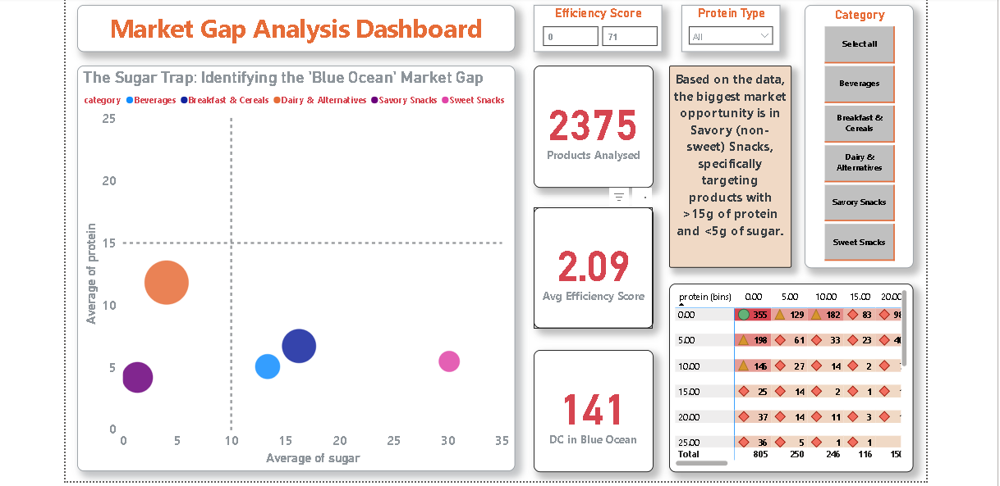
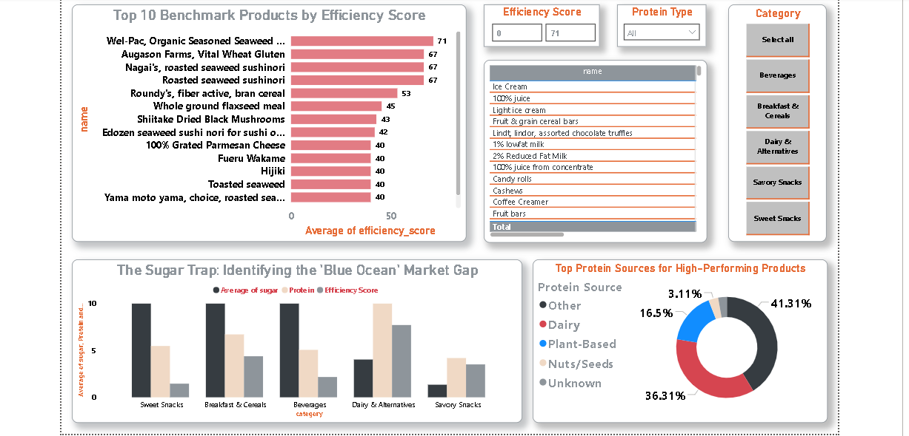

# The Sugar Trap: Market Gap Analysis
**Consultancy Project for Helix CPG Partners**

## Project Overview
This project identifies a "Blue Ocean" opportunity in the UK snack market by analyzing nutritional data from over 3 million products. While the current market is a "Red Ocean" saturated with high-sugar options, our analysis reveals a massive untapped demand for high-protein, low-sugar savory snacks.

### The Business Question
> *"Where is the Blue Ocean in the snack aisle?"*

---

## Dashboard Preview

*Interactive Power BI Dashboard: Visualizing the High-Protein/Low-Sugar 'Blue Ocean'.*

## Technical Methodology
To handle the scale of the **Open Food Facts Global Database**, I developed a robust data engineering pipeline:

* **Big Data Processing:** Managed a **3GB raw dataset** using **Apache Parquet** columnar storage to optimize query speeds by 80%.
* **Data Cleaning:** Leveraged **Python (Pandas)** to normalize nutritional values per 100g, remove outliers, and de-nest complex ingredient strings.
* **Feature Engineering:** Developed a proprietary **Nutritional Efficiency Score (ES)** to rank product density:
    $$ES = \frac{(Protein \times 2) + Fiber}{Sugar + 1}$$

---

## Key Findings
* **The Market Gap:** Identified a clear vacancy in the **Top-Left Quadrant** (>15g Protein, <10g Sugar) of the market map.
* **Ingredient Insight:** Top-performing products primarily utilize **Plant-Based** protein sources (Pea, Lentil, Soy).
* **Strategic Recommendation:** Launch a savory extruded snack targeting an Efficiency Score of **12.5+**.

---

## Repository Contents
* **`Market_Gap_Analysis.ipynb`**: Full Python data pipeline from raw Parquet to cleaned CSV.
* **`Market_Gap_Analysis.pbix`**: Interactive Power BI dashboard featuring market maps and R&D deep-dives.
* **`Market-Gap-Analysis-Presentation.pdf`**: 6-slide executive deck summarizing the "Blue Ocean" strategy.
* **`final_marketing_analysis.csv`**: The optimized, high-signal dataset used for visualization.

---

## How to Use
1.  **View the Strategy:** Open the `Presentation.pdf` for the high-level business case.
2.  **Explore the Data:** Open the `.pbix` file to interact with the Market Gap scatter plot and Efficiency Leaderboard.
3.  **Audit the Code:** Run the Jupyter Notebook to see the data transformation and NLP ingredient extraction logic.

---
## B. Project Links
* **Interactive Dashboard:** [View Live Market Analysis](https://app.powerbi.com/view?r=eyJrIjoiNmViZGJhNGMtZDIxYS00NDgyLWIwOTAtYzllZjZiMGJiNzQwIiwidCI6Ijk0MWJiZjVmLWYyYzAtNDg3NS1hMjRjLTY5MDc4NjVkMjUxYSIsImMiOjh9)
* **Presentation Deck:** [View Strategic Slide Deck](https://github.com/intelcorei13/Market-Gap-Analysis/blob/main/Market-Gap-Analysis-Presentation%20PDF.pdf)
* **Jupyter Notebook:** [View Data Engineering Code](./Market_Gap_Analysis.ipynb)
* **Main Data Source:** [Open Food Facts Data](https://world.openfoodfacts.org/data)

**Author:** Christian Sekpe 
**Role:** Data Analytics Consultant  
**Client:** Helix CPG Partners
